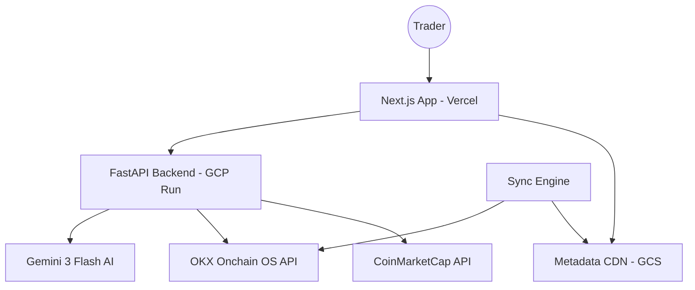

# Nexus-Sentry: X Layer Portfolio Intelligence & AI Co-Pilot

## 🛡️ Project Overview
**Nexus-Sentry** is a high-fidelity, institutional-grade DeFi dashboard and AI assistant built specifically for the **X Layer** (Chain ID 196) ecosystem. It transforms the complex data landscape of OKX's L2 into a streamlined, actionable "Pro Terminal" for traders and researchers.

---

## 🏗️ System Architecture

Nexus-Sentry follows a **Hybrid Serverless Architecture** designed for speed, security, and low-latency data delivery.



---

## 🔗 The Power of X Layer Onchain OS

The core "brain" of Nexus-Sentry's data layer is the **OKX Onchain OS**. Critically, this is not just an API; it is a specialized abstraction layer that eliminates the friction of raw blockchain development.

### Why it's Critical for Nexus-Sentry:
1.  **Unified Multi-Chain Interface**: While we focus on X Layer, Onchain OS allows the backend to use standardized schemas for any supported L1/L2, making the app "future-proof" for expansion.
2.  **Native Decoding**: Traditionally, developers must manually parse ABIs to understand transaction history. Onchain OS provides **human-readable** transaction types (Swap, Stake, Burn) directly.
3.  **Agentic Optimization**: The API is designed with "Agentic Skills" in mind, offering structured JSON that large language models (like Gemini) can parse with 99% accuracy.
4.  **Institutional Reliability**: Leveraging OKX's proprietary node infrastructure ensures that "Network Errors" are handled via smart multi-path broadcasting, a feature we utilize in the Transaction Gateway.

---

## 🛠️ Backend Integration & API Deep Dive

The FastAPI backend handles the heavy lifting of signing requests and interacting with Onchain OS. Below are the critical endpoints that power the experience:

| Feature | Onchain OS Endpoint | Significance |
| :--- | :--- | :--- |
| **Portfolio Valuation** | `/api/v6/dex/balance/total-value-by-address` | Provides the "Source of Truth" for the user's net worth across the ecosystem. |
| **Asset Inventory** | `/api/v6/dex/balance/all-token-balances-by-address` | Decodes all ERC-20 tokens, automatically mapping decimals and logos. |
| **Actionable History** | `/api/v6/dex/post-transaction/transactions-by-address` | Powers the institutional-grade scrollable transaction list. |
| **Swap Hub** | `/api/v6/dex/aggregator/quote` | Fetches real-time routing data from the OKX Aggregator for optimal pricing. |
| **PnL Intelligence** | `/api/v6/dex/market/portfolio/overview` | Calculates realized/unrealized gains, giving the AI data for financial reports. |
| **Research Hub** | `/api/v6/defi/product/search` | Enables the Discovery page to locate staking, LP, and lending opportunities. |
| **Monetization (x402)** | `/api/v6/x402/settle` | Settles gas-lite on-chain payments, enabling the "Support Project" protocol. |

### How it was Done:
- **HMAC Authentication**: Every request is signed in the `OKXClient` using a secure timestamp + method + path + body string. This ensures that the private keys (API, Secret, Passphrase) never leave the backend environment.
- **Segmented Fetching**: To avoid the "All-or-Nothing" data trap, we integrated these endpoints into Next.js using a segmented approach—loading balances first and hydrating PnL history in the background.

---

## 🎭 User Story: A Day with Sentry Intelligence

**User**: *Alex, a DeFi researcher on X Layer.*

1.  **Morning Check-In**: Alex opens Nexus-Sentry. The "System Pulse" glows green, indicating the Cloud Run backend is healthy. He immediately sees his **Portfolio Valuation** is up 5% due to a recent ETH move.
2.  **AI Consultation**: Alex opens the "Nexus Command Center" (AI Sidebar) and asks: *"I have 500 USDC sitting idle. Where can I earn the best yield without high impermanent loss?"*
3.  **Sentry Intelligence**: The AI calls `research_yield` and returns a **Strategic Intelligence Report**. It suggests a stablecoin LP pool on StarryNift, highlighting a 12% APY.
4.  **Execution & Protection**: Alex decides to swap. Sentry prepares a quote but detects a **High Price Impact (4.2%)**. A red "Sentry Alert" appears: *"Liquidity gap detected. Proposing CEX Loop strategy or TWAP execution to save $21 in slippage."*
5.  **Support**: Alex is impressed by the whale protection. Before closing, he expands the **Support Project** drawer and clicks "Send USDG." He signs a permit in his OKX Wallet (via x402), effortlessly supporting the project over the air.

---

## 🛠️ Replication Guide: Step-by-Step

### Prerequisites
- **Node.js 18+** & **Python 3.10+**
- **GCP Account** (Cloud Run, GCS, Secret Manager)
- **API Keys**: OKX Web3 API, Gemini API, CoinMarketCap API.

### 1. Backend Setup
```bash
cd backend
pip install -r requirements.txt
uvicorn main:app --reload
```

### 2. Metadata Sync
```bash
curl -X POST http://localhost:8000/sync/metadata?chain_id=196
```

### 3. Frontend Setup
```bash
cd frontend
npm install
npm run dev
```

---

## 🏗️ Evolution Path (Last 7 Sessions)
1.  **V1**: Basic Prototype & Metadata CDN setup.
2.  **V2**: "Obsidian Neon" UI design system.
3.  **V3**: HMAC Auth Security & GCP Deployment.
4.  **V4**: Gemini 3 AI Integration with "Tool Intelligence."
5.  **V5**: Next.js Proxy Pattern for CORS stability.
6.  **V6**: Data Hydration Optimization.
7.  **V7**: x402 Protocol Settlement & Swap Stabilization.

---
*Developed for the X Layer Ecosystem | 🛡️ Nexus-Sentry Intelligence*
