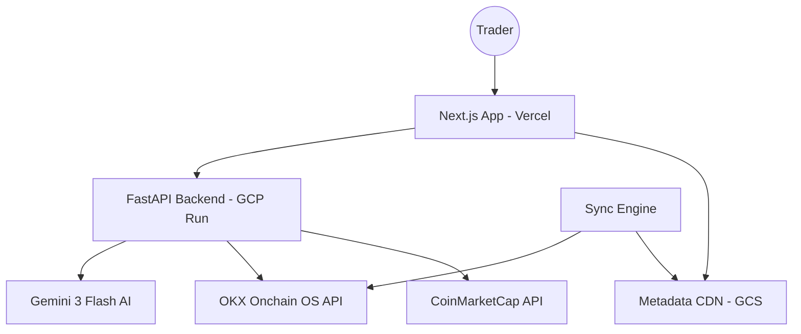

# Nexus-Sentry: X Layer Portfolio Intelligence & AI Co-Pilot

## 🛡️ Project Overview
**Nexus-Sentry** is a high-fidelity, institutional-grade DeFi dashboard and AI assistant built specifically for the **X Layer** (Chain ID 196) ecosystem. It transforms the complex data landscape of OKX's L2 into a streamlined, actionable "Pro Terminal" for traders and researchers.

This application was developed through seven intensive iterations, evolving from a simple API script into a cloud-native, AI-augmented platform.

---

## 🏗️ System Architecture

Nexus-Sentry follows a **Hybrid Serverless Architecture** designed for speed, security, and low-latency data delivery.



---

## 🚀 Key Features

### 1. The Obsidian Neon Dashboard
- **Asset Inventory**: High-performance grid layout for tracking ERC-20 tokens with live sparklines.
- **System Pulse**: Real-time monitoring of backend API health and X Layer network status.
- **Segmented Fetching**: Core wallet data loads instantly, while heavier historical data (PnL/Activity) hydrates in the background for a lag-free experience.

### 2. Sentry AI Co-Pilot & Optimization Engine
- **Pre-Trade Decision Engine**: Nexus-Sentry doesn't just warn about slippage; it computes alternative execution paths (Split Trades, CEX Loops) and presents them side-by-side.
- **Quantified Comparison**: Users see exactly how many extra tokens they receive by choosing an optimized strategy.
- **Context-Aware Chat**: The AI knows your wallet address, current page, and recent market trends.
- **Tool Calling**: The agent can call functions like `get_user_portfolio()` to answer complex questions ("Is my LP position profitable?").

### 3. Advanced Swap & Discovery
- **Fuzzy Search**: Instantly search through 1,000+ X Layer assets.
- **x402 Protocol**: Integrated "gas-lite" donation system that allows users to support the project via EIP-712 signed permits.
- **TVL/APY Analytics**: Real-time and historical charting for X Layer DeFi pools.

---

## 🔗 The Power of X Layer Onchain OS

The core "brain" of Nexus-Sentry's data layer is the **OKX Onchain OS**. Critically, this is not just an API; it is a specialized abstraction layer that eliminates the friction of raw blockchain development.

### Why it's Critical for Nexus-Sentry:
1.  **Unified Multi-Chain Interface**: While we focus on X Layer, Onchain OS allows the backend to use standardized schemas for any supported L1/L2, making the app "future-proof" for expansion.
2.  **Native Decoding**: Traditionally, developers must manually parse ABIs to understand transaction history. Onchain OS provides **human-readable** transaction types (Swap, Stake, Burn) directly.
3.  **Agentic Optimization**: The API is designed with "Agentic Skills" in mind, offering structured JSON that large language models (like Gemini) can parse with 99% accuracy.
4.  **Institutional Reliability**: Leveraging OKX's proprietary node infrastructure ensures that "Network Errors" are handled via smart multi-path broadcasting, a feature we utilize in the Transaction Gateway.

---

## 🛠️ Backend Integration & API Deep Dive

The FastAPI backend handles the heavy lifting of signing requests and interacting with Onchain OS. Below are the critical endpoints that power the experience:

| Feature | Onchain OS Endpoint | Significance |
| :--- | :--- | :--- |
| **Portfolio Valuation** | `/api/v6/dex/balance/total-value-by-address` | Provides the "Source of Truth" for the user's net worth across the ecosystem. |
| **Asset Inventory** | `/api/v6/dex/balance/all-token-balances-by-address` | Decodes all ERC-20 tokens, automatically mapping decimals and logos. |
| **Actionable History** | `/api/v6/dex/post-transaction/transactions-by-address` | Powers the institutional-grade scrollable transaction list. |
| **Swap Hub** | `/api/v6/dex/aggregator/quote` | Fetches real-time routing data from the OKX Aggregator for optimal pricing. |
| **PnL Intelligence** | `/api/v6/dex/market/portfolio/overview` | Calculates realized/unrealized gains, giving the AI data for financial reports. |
| **Research Hub** | `/api/v6/defi/product/search` | Enables the Discovery page to locate staking, LP, and lending opportunities. |
| **Monetization (x402)** | `/api/v6/x402/settle` | Settles gas-lite on-chain payments, enabling the "Support Project" protocol. |

### How it was Done:
- **HMAC Authentication**: Every request is signed in the `OKXClient` using a secure timestamp + method + path + body string. This ensures that the private keys (API, Secret, Passphrase) never leave the backend environment.
- **Segmented Fetching**: To avoid the "All-or-Nothing" data trap, we integrated these endpoints into Next.js using a segmented approach—loading balances first and hydrating PnL history in the background.

---

## 🎭 User Story: A Day with Sentry Intelligence

**User**: *Alex, a DeFi researcher on X Layer.*

1.  **Morning Check-In**: Alex opens Nexus-Sentry. The "System Pulse" glows green, indicating the Cloud Run backend is healthy. He immediately sees his **Portfolio Valuation** is up 5% due to a recent ETH move.
2.  **AI Consultation**: Alex opens the "Nexus Command Center" (AI Sidebar) and asks: *"I have 500 USDC sitting idle. Where can I earn the best yield without high impermanent loss?"*
3.  **Optimization & Protection**: Alex decides to swap. Sentry detects a **High Price Impact (4.2%)** and instead of a simple warning, it displays the **Strategic Optimization Panel**. 
4.  **Strategic Comparison**: Alex sees three options: **Direct ($21 Loss)**, **Split ($8 Loss)**, and **CEX Loop ($2 Loss)**.
5.  **One-Click Execution**: Alex clicks **"Apply Split Optimization"**. The system automatically re-calibrates the trade to 1/3 of the size and begins the staggering routine. Sentry saves Alex $13 instantly.
6.  **Support**: Alex is impressed by the whale protection. Before closing, he expands the **Support Project** drawer and clicks "Send USDG." He signs a permit in his OKX Wallet (via x402), effortlessly supporting the project over the air.

---

## 🛠️ Replication Guide: Step-by-Step

### Prerequisites
- **Node.js 18+** & **Python 3.10+**
- **GCP Account** (Cloud Run, GCS, Secret Manager)
- **API Keys**: OKX Web3 API, Gemini API, CoinMarketCap API.

### 1. Backend Setup (FastAPI)
The backend acts as the secure bridge and auth-signer for the OKX API.

**Exact Auth Logic (okx_utils.py):**
```python
# Minimal HMAC Signing Example
import hmac, hashlib, base64, time

def generate_signature(api_secret, timestamp, method, path, body=""):
    prehash = f"{timestamp}{method.upper()}{path}{body}"
    mac = hmac.new(api_secret.encode(), prehash.encode(), hashlib.sha256)
    return base64.b64encode(mac.digest()).decode()
```

**Installation:**
```bash
cd backend
python -m venv venv
source venv/bin/activate
pip install -r requirements.txt
uvicorn main:app --reload
```

### 2. Metadata Sync Engine
This optimizes the frontend by serving token lists from a CDN.

**Implementation:**
```bash
# Triggers the backend sync engine to pull from OKX and push to GCS
curl -X POST http://localhost:8000/sync/metadata?chain_id=196
```

### 3. Frontend Setup (Next.js)
The frontend uses a server-side proxy to communicate with the backend to bypass CORS issues.

**Installation:**
```bash
cd frontend
npm install
npm run dev
```

**Key Environment Variables (.env.local):**
```ini
NEXT_PUBLIC_API_BASE=http://localhost:8000
# In production, this changes to your Cloud Run URL
```

---

## 💎 Advanced Configuration: AI Tool Calling

To replicate the AI's ability to "see" your wallet, the Gemini agent is configured with a list of Python functions (Tools).

```python
# backend/agent_utils.py example
def get_user_portfolio(address: str):
    # Calls OKX API to get balances
    return okx_client.get_balances(address)

model = GenerativeModel(
    model_name="gemini-3-flash-preview",
    tools=[get_user_portfolio, fetch_swap_quote]
)
```

---

## 🏗️ Evolution Path (Last 7 Sessions)
1.  **V1**: Basic Prototype & Metadata CDN setup.
2.  **V2**: "Obsidian Neon" UI design system & Viem integration.
3.  **V3**: HMAC Auth Security & GCP Cloud Run migration.
4.  **V4**: Gemini 3 AI Integration with "Tool Intelligence."
5.  **V5**: Next.js Proxy Pattern to resolve Cloud Run CORS failures.
6.  **V6**: Data Hydration Optimization & Recharts stability fix.
7.  **V7**: x402 Protocol Settlement & Swap Stabilization.

---

## 📜 Glossary
- **X Layer**: OKX's high-speed Ethereum L2 built using Polygon CDK.
- **Onchain OS**: OKX's developer-first API for fetching clean, decoded blockchain data.
- **x402**: A specialized protocol for handling gas-less or permit-based payments on X Layer.

---
*Developed for the X Layer Ecosystem | 🛡️ Nexus-Sentry Intelligence*
