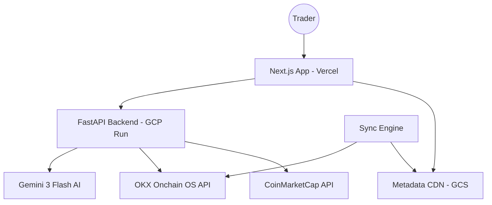

# Nexus-Sentry: X Layer Portfolio Intelligence & AI Co-Pilot

## 🛡️ Project Overview
**Nexus-Sentry** is a high-fidelity, institutional-grade DeFi dashboard and AI assistant built specifically for the **X Layer** (Chain ID 196) ecosystem. It transforms the complex data landscape of OKX's L2 into a streamlined, actionable "Pro Terminal" for traders and researchers.

This application was developed through seven intensive iterations, evolving from a simple API script into a cloud-native, AI-augmented platform.

---

## 🏗️ System Architecture

Nexus-Sentry follows a **Hybrid Serverless Architecture** designed for speed, security, and low-latency data delivery.



### Core Components
1.  **Frontend (Next.js 15+ & Tailwind CSS)**: A high-density dashboard utilizing glassmorphism ("Obsidian Neon") and real-time data visualization via Recharts.
2.  **Backend (FastAPI)**: A secure Python-based engine that handles OKX V6 authentication (HMAC-SHA256), AI tool-calling, and protocol settlements.
3.  **Metadata CDN (Google Cloud Storage)**: To bypass API rate limits and long load times, the app uses a sync engine that pushes 1,000+ token/pool definitions to a public CDN as static JSON.
4.  **Sentry Intelligence (Gemini 3)**: An AI agent with direct access to your wallet balances and market tools, capable of proposing swaps and analyzing PnL.

---

## 🚀 Key Features

### 1. The Obsidian Neon Dashboard
- **Asset Inventory**: High-performance grid layout for tracking ERC-20 tokens with live sparklines.
- **System Pulse**: Real-time monitoring of backend API health and X Layer network status.
- **Segmented Fetching**: Core wallet data loads instantly, while heavier historical data (PnL/Activity) hydrates in the background for a lag-free experience.

### 2. Sentry AI Co-Pilot
- **Context-Aware Chat**: The AI knows your wallet address, current page, and recent market trends.
- **Tool Calling**: The agent can actually call functions like `get_user_portfolio()` or `fetch_swap_quote()` to answer complex questions ("Is my LP position on OKX profitable right now?").
- **Strategic Intelligence**: Automatically detects high-price impact trades and suggests alternatives like "CEX Loops" to save on slippage.

### 3. Advanced Swap & Discovery
- **Fuzzy Search**: Instantly search through 1,000+ X Layer assets.
- **x402 Protocol**: Integrated "gas-lite" donation system that allows users to support the project via EIP-712 signed permits.
- **TVL/APY Analytics**: Real-time and historical charting for X Layer DeFi pools.

---

## 🛠️ Replication Guide: Step-by-Step

### Prerequisites
- **Node.js 18+** & **Python 3.10+**
- **GCP Account** (Cloud Run, GCS, Secret Manager)
- **API Keys**: OKX Web3 API, Gemini API, CoinMarketCap API.

### 1. Backend Setup (FastAPI)
The backend acts as the secure bridge and auth-signer for the OKX API.

**Exact Auth Logic (okx_utils.py):**
```python
# Minimal HMAC Signing Example
import hmac, hashlib, base64, time

def generate_signature(api_secret, timestamp, method, path, body=""):
    prehash = f"{timestamp}{method.upper()}{path}{body}"
    mac = hmac.new(api_secret.encode(), prehash.encode(), hashlib.sha256)
    return base64.b64encode(mac.digest()).decode()
```

**Installation:**
```bash
cd backend
python -m venv venv
source venv/bin/activate
pip install -r requirements.txt
uvicorn main:app --reload
```

### 2. Metadata Sync Engine
This optimizes the frontend by serving token lists from a CDN.

**Implementation:**
```bash
# Triggers the backend sync engine to pull from OKX and push to GCS
curl -X POST http://localhost:8000/sync/metadata?chain_id=196
```

### 3. Frontend Setup (Next.js)
The frontend uses a server-side proxy to communicate with the backend to bypass CORS issues.

**Installation:**
```bash
cd frontend
npm install
npm run dev
```

**Key Environment Variables (.env.local):**
```ini
NEXT_PUBLIC_API_BASE=http://localhost:8000
# In production, this changes to your Cloud Run URL
```

---

## 💎 Advanced Configuration: AI Tool Calling

To replicate the AI's ability to "see" your wallet, the Gemini agent is configured with a list of Python functions (Tools).

```python
# backend/agent_utils.py example
def get_user_portfolio(address: str):
    # Calls OKX API to get balances
    return okx_client.get_balances(address)

model = GenerativeModel(
    model_name="gemini-3-flash-preview",
    tools=[get_user_portfolio, fetch_swap_quote]
)
```

---

## 🏗️ Evolution Path (Last 7 Sessions)
1.  **V1**: Basic Prototype & Metadata CDN setup.
2.  **V2**: "Obsidian Neon" UI design system & Viem integration.
3.  **V3**: HMAC Auth Security & GCP Cloud Run migration.
4.  **V4**: Gemini 3 AI Integration with "Tool Intelligence."
5.  **V5**: Next.js Proxy Pattern to resolve Cloud Run CORS failures.
6.  **V6**: Data Hydration Optimization & Recharts stability fix.
7.  **V7**: x402 Protocol Settlement & Swap Stabilization.

---

## 📜 Glossary
- **X Layer**: OKX's high-speed Ethereum L2 built using Polygon CDK.
- **Onchain OS**: OKX's developer-first API for fetching clean, decoded blockchain data.
- **x402**: A specialized protocol for handling gas-less or permit-based payments on X Layer.

---
*Created with 🛡️ Nexus-Sentry Intelligence*
