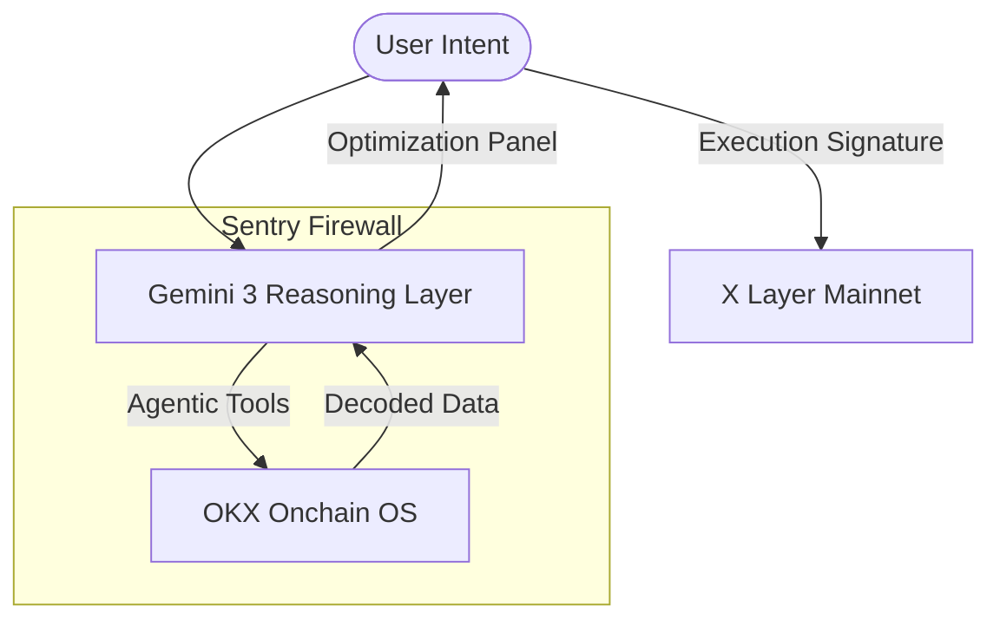

# Nexus-Sentry V2: The Execution Intelligence Layer 🛡️
### *The Reasoning Layer for Agentic DeFi on X Layer*


---

## 🏛️ The Vision: Moving Beyond Passive Dashboards

In the current DeFi landscape, users suffer from **"Execution Anxiety."** Traditional dashboards are passive mirrors; they show you what you've already lost or where you've already failed. When it comes to the actual transaction, users are forced into **"Blind Signing"**—approving complex hex data without a reasoning agent to protect them from liquidity gaps, slippage tax, or protocol bad debt.

**Nexus-Sentry V2 changes the paradigm.** It is not a dashboard; it is **Execution Infrastructure**. It acts as the missing **Reasoning Layer** between User Intent and Onchain Action. Built natively on **X Layer (Chain 196)** and powered by **OKX Onchain OS**, Nexus-Sentry provides an **Execution Firewall** that sanitizes every intent before a single wei is moved.

---

## 🧠 Core Architecture: The "Sentry" Philosophy

Nexus-Sentry follows a **"Brain Before Muscle"** approach. We have prioritized the development of high-fidelity reasoning engines over automated execution to solve the industry-wide problem of non-deterministic AI behavior.

### 1. The Execution Firewall
Nexus-Sentry is an active sentry. It doesn't just watch trades; it **sanitizes** them. Our engine detects price impact in real-time. If a liquidity gap is identified, the firewall triggers, blocking the sub-optimal path and forcing a strategic intelligence brief.

### 2. Strategic Intelligence Panel (SIP)
Why settle for a "Market Swap" when you can optimize for "Maximum Retained Value"? Nexus-Sentry quantifies the delta between three execution paths:
- **Direct Swap**: Standard execution (exposed to slippage tax).
- **Split-Execution (Sequential Intent)**: Automatically staggered trades to allow liquidity rebalancing.
- **CEX-DEX Loop**: Utilizing the deep liquidity of the OKX CEX bridge for institutional-size moves.

### 3. Protocol Risk Mitigation (The AAVE Guard)
The AI Agent doesn't just look at YOUR balance; it looks at the **Protocol's Health**. By tracking real-time health factors and liquidity depth on platforms like AAVE, Nexus-Sentry proactively warns users of systemic risks—preventing them from being caught in "AAVE-style" bad debt events before the pool becomes illiquid.

---

## 🛠️ Technical Architecture

The Nexus-Sentry workflow transforms a simple user intent into a high-fidelity execution strategy.



---

## 🏆 Why Nexus-Sentry Wins

| Feature | Passive Dashboards (Web2.5) | Nexus-Sentry V2 (Agentic DeFi) |
| :--- | :--- | :--- |
| **Logic Mode** | Reactive (Shows History) | **Predictive (Simulates Future)** |
| **Slippage** | Shows it after the trade | **Calculates alternative paths pre-trade** |
| **User Safety** | Passive Info | **Active Execution Firewall** |
| **Data Source** | Raw RPC (Slow) | **OKX Onchain OS Native (Instant)** |
| **AI Role** | Customer Support Chat | **Sequential Intent Reasoning Layer** |

---

## 🚀 The 2026 Roadmap: Autonomous Wealth Management

We are building the foundation for a fully autonomous capital layer on X Layer.

- **Q4 2025: ERC-4337 Integration**: The transition from the "Dashboard" to the "Agentic Wallet," enabling gas-less batch execution for our Split-Trade strategies.
- **Q1 2026: Autonomous Liquidity Management**: AI-managed rebalancing between AAVE, Uniswap, and X Layer native protocols based on real-time health factor telemetry.
- **Q2 2026: Multi-Path Intent Batching**: High-concurrency intent fulfillment where the AI handles complex, multi-protocol yield loops without user intervention.

---

## 🛠️ Deployment & Quickstart

### Backend (The Logic Engine)
```bash
cd backend
pip install -r requirements.txt
uvicorn main:app --port 8000
```

### Frontend (The Command Interface)
```bash
cd frontend
npm install
npm run dev
```

---

## 💎 Sustainability & Support

Nexus-Sentry is built for the long term. We have integrated the **x402 Protocol** to enable a gas-lite support layer. If the Sentry saves you capital, you can support the project via a secure, EIP-712 signed donation permit directly settling on-chain.

*Developed with 🛡️ by the Nexus-Sentry Team for the X Layer Ecosystem.*
