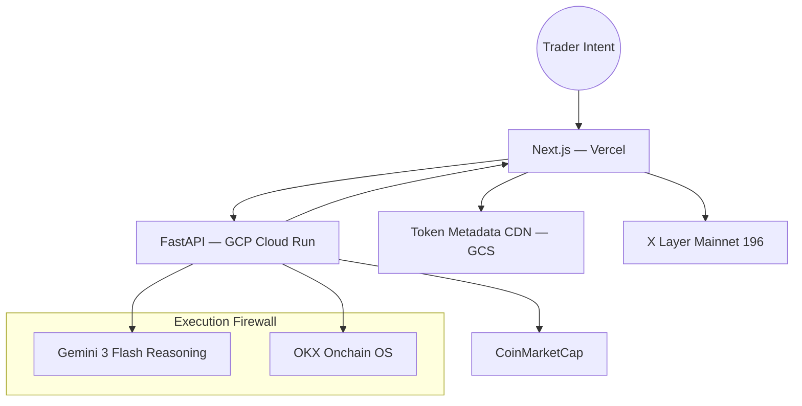

# Nexus-Sentry V2 🛡️
### Execution Intelligence Layer for X Layer DeFi


---


[](https://youtu.be/XYodndZaBFE)
---
## The Problem: DeFi Users Are Flying Blind

Every day, traders on X Layer lose capital to the same three silent killers:

- **Slippage Tax** — Large swaps silently bleed value into pool mechanics
- **Liquidity Gaps** — Thin pools punish market orders without warning
- **Blind Signing** — Users approve complex hex data with no reasoning agent
  to protect them

Traditional dashboards are **passive mirrors**. They show you what you've
already lost — never what you're about to lose.

---

## The Solution: An Execution Firewall

Nexus-Sentry sits between your intent and the chain.

> *"Swap 500 USDC → ETH"* becomes:
> *"What is the most capital-efficient way to execute this trade?"*

Before a single wei moves, Nexus-Sentry simulates three execution paths
and presents the delta — in real dollars — side by side:

| Strategy | ETH Received | Loss | Saved vs. Direct |
| :--- | :--- | :--- | :--- |
| Direct Swap | 0.312 ETH | $21 | — |
| Split Execution (3×) | 0.318 ETH | $8 | **+$13** |
| CEX–DEX Loop | 0.325 ETH | $2 | **+$19** |

One click. The system recalibrates your trade and executes the optimal path.
**We don't just detect bad trades — we rewrite them.**

---

## Core Architecture

Nexus-Sentry is a cloud-native, AI-augmented platform built across
seven iterations — from a single API script to a production-grade system.



---

## Key Capabilities

### 1. Pre-Trade Optimization Engine
The Strategic Intelligence Panel (SIP) fires automatically when price
impact exceeds threshold. It computes and compares:

- **Direct Swap** — Standard path, full slippage exposure
- **Split Execution** — TWAP-style staggering to let liquidity rebalance
- **CEX–DEX Loop** — Routes through OKX's deep CEX liquidity for
  institutional-size moves

### 2. Gemini AI Co-Pilot (Tool-Calling)
The AI agent has live access to your wallet and the chain — not just
a static knowledge base. It calls real functions:

```python
get_user_portfolio(address)   # Live balances + PnL
fetch_swap_quote(token_in, token_out, amount)  # Real-time routing
```

Ask it: *"Is my LP position profitable?"* — and it answers with your
actual numbers.

### 3. Protocol Risk Guard
The agent monitors real-time health factors on lending protocols
(AAVE-style pools on X Layer), warning users before they enter
positions that could lead to bad debt or liquidation.

### 4. Obsidian Neon Dashboard
- Live ERC-20 asset grid with sparklines
- Segmented fetching — balances load instantly, PnL hydrates in background
- System Pulse — real-time backend and X Layer network health monitor
- Fuzzy search across 1,000+ X Layer assets

---

## Why OKX Onchain OS is the Foundation

Nexus-Sentry's intelligence is only possible because of what Onchain OS
provides that raw RPC cannot:

| Raw RPC | OKX Onchain OS |
| :--- | :--- |
| Hex-encoded ABI data | Human-readable types (Swap, Stake, Burn) |
| Single-chain, manual parsing | Unified multi-chain schema |
| Error-prone node calls | Multi-path broadcast reliability |
| Unstructured JSON | LLM-optimized structured responses |

This is what makes real-time strategy comparison — and AI reasoning over
live trade data — possible.

**Critical endpoints powering the experience:**

| Feature | Endpoint |
| :--- | :--- |
| Portfolio Valuation | `/api/v6/dex/balance/total-value-by-address` |
| Asset Inventory | `/api/v6/dex/balance/all-token-balances-by-address` |
| Swap Optimization | `/api/v6/dex/aggregator/quote` |
| PnL Intelligence | `/api/v6/dex/market/portfolio/overview` |
| DeFi Discovery | `/api/v6/defi/product/search` |
| x402 Settlement | `/api/v6/x402/settle` |

---

## Quickstart

### Backend
```bash
cd backend
python -m venv venv && source venv/bin/activate
pip install -r requirements.txt
uvicorn main:app --reload --port 8000
```

### Frontend
```bash
cd frontend
npm install
npm run dev
```

### Environment Variables
```ini
# .env.local
NEXT_PUBLIC_API_BASE=http://localhost:8000
OKX_API_KEY=your_key
OKX_SECRET=your_secret
OKX_PASSPHRASE=your_passphrase
GEMINI_API_KEY=your_key
```

---

## Roadmap

| Quarter | Milestone |
| :--- | :--- |
| Q4 2025 | ERC-4337 integration — gasless batch execution for split trades |
| Q1 2026 | Autonomous liquidity rebalancing across AAVE + Uniswap + X Layer native |
| Q2 2026 | Multi-path intent batching — AI handles complex yield loops end-to-end |

---

## Sustainability

Nexus-Sentry integrates the **x402 Protocol** — users can support the
project via EIP-712 signed permits, settling gas-lite on-chain through
their OKX Wallet. If Sentry saves you capital, you can give back
without friction.

---

*Built natively for X Layer (Chain 196) | 🛡️ Nexus-Sentry Intelligence*
